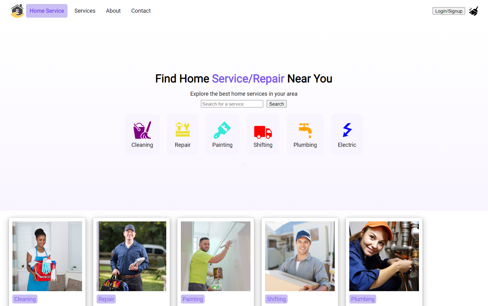

https://www.iamjunior.lt/front-end-akceleratorius-javascript course task

# To run the project
0. git clone https://github.com/azegas/iamjunior-home-service
1. cd iamjunior-home-service
2. npm i
3. npm run dev
3. npx json-server --watch data/db.json --port 8000

# DONE bonus features
- [x] Mimicking loading functionality - fetching what is "static" quickly, fetching businesses with setTimeout to imitate loading, so the user is aware, that he will get some information soon. Not having a long initial loading screen.
- [x] json server to to mimic and provide fake data
- [x] active class both in menu and in service search
- [x] loading effect faked in useFetchApi hook by adding setTimeout
- [x] catch error in useFetchApi hook and display it in the component
- [x] go to individual business pages
- [x] 404 page
- [x] favicon
- [x] deployed to vercel

# TODO bonus features
- [ ] Functional search in homepage
- [ ] pagination (100 businesses)
- [ ] absolute paths instead of ../../
- [ ] dark mode - https://usehooks-ts.com/react-hook/use-dark-mode

# Actual project requirements
- [x] Topbar komponentas: Tai turėtų apimti logotipą ir navigacijos meniu, kuris kol kas gali būti statinis (vėliau bus įtrauktas react-router).
- [x] Paieškos juosta: Centrinė paieškos juosta su mygtuku. Nors interaktyvi paieška dar nebus įgyvendinta, svarbu paruošti input elementą ir paieškos mygtuką.
- [x] Kategorijos kortelė: Paslaugų sekcijoje, kiekviena paslauga (pvz., “Cleaning”, “Repair”) turėtų būti atvaizduojama kaip atskiras komponentas su ikona ir tekstiniu aprašymu.
- [x] Stilius: SCSS modules arba Styled-components
- [ ] Responsive design (optional): Naudoti CSS media queries, kad puslapis tinkamai atrodytų įvairaus dydžio įrenginiuose.
- [x] Būsenos valdymas: Nors šioje užduotyje būsenos valdymo galimybių nebus daug, verta paruošti būsimam funkcionalumui su useState. Galima paruošti search inputui.
- [x] Topbar komponentas: Įgyvendinti navigaciją react-router-dom pagalba tarp puslapių Home, Services ir About Us. Naudoti Link komponentą
- [x] Login mygtukas: Paspaudus Login/Sign Up mygtuką naviguoti į Login puslapį naudojant useNavigate hooką
- [x] Paslaugų kortelė: Paspaudus ant kortelės naviguoti į /search/:category routą
- [x] Routes: Įgyivendinti naujus maršrutus (routes) tokius kaip: Home, Services, About Us, Login, Register, SearchCategory
- [x] Categories komponentas: Įgyvendinti kategorijų pasirinkimą. Paspaudus ant kitos kategorijos turi pasikeisti ir URL iš /search/cleaning į /search/repair
- [x] Filtravimas: Išfiltruoti tik tas paslaugas kurios įeina į kategoriją
- [ ] Save as favorite (optional): Pridėti ant kortelės širdelės arba žymos ikoną, kurią nuspaudus būtų išsaugotą paslauga į localStorage. Galite naudoti useLocalStorage hooksą.